# Rebuy

Rebuy is a mobile for buying and selling second-hand items, built with Flutter for the frontend and NestJS for the backend. It demonstrates full-stack development skills and a focus on usability and clean architecture.
## Screenshots

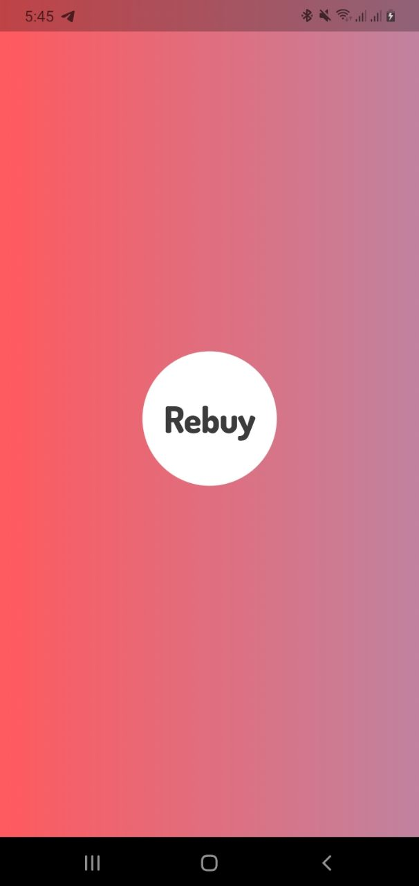
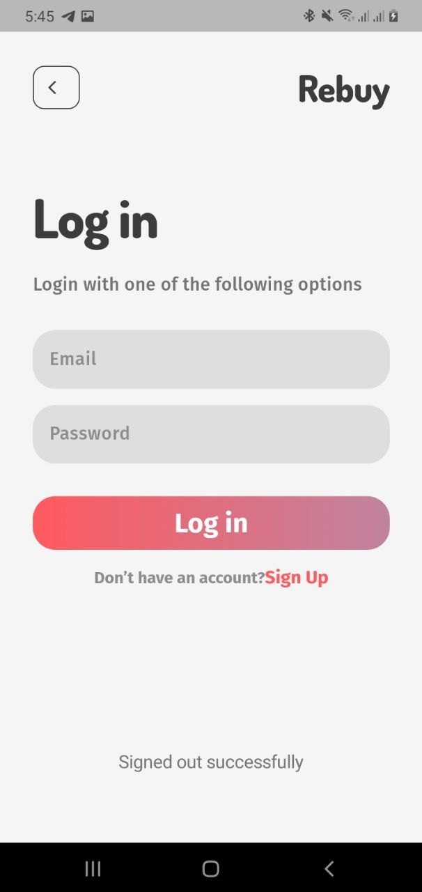
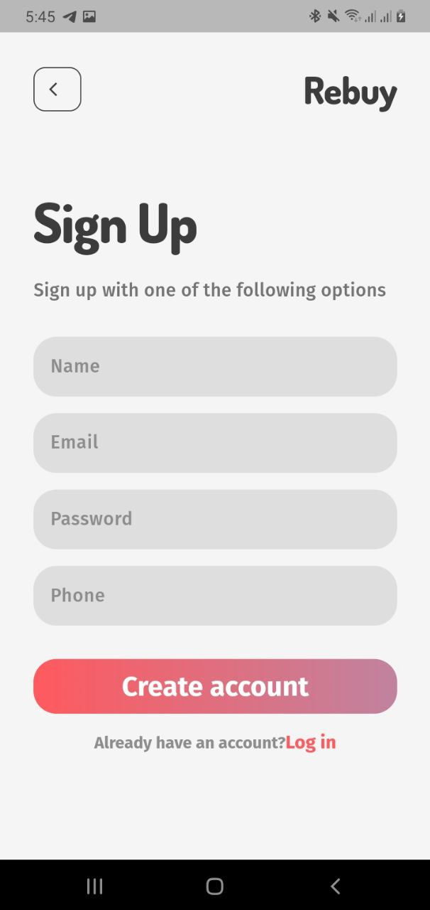
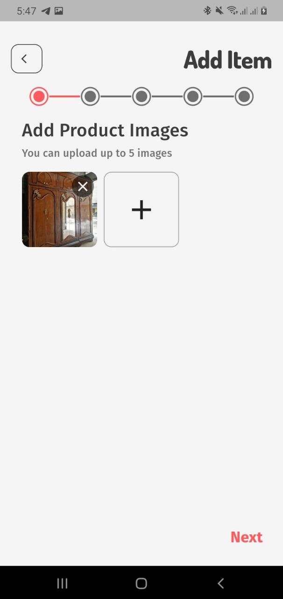
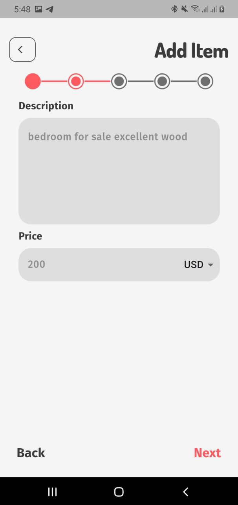
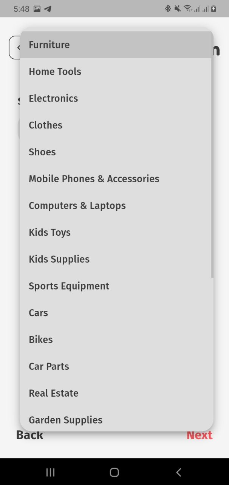
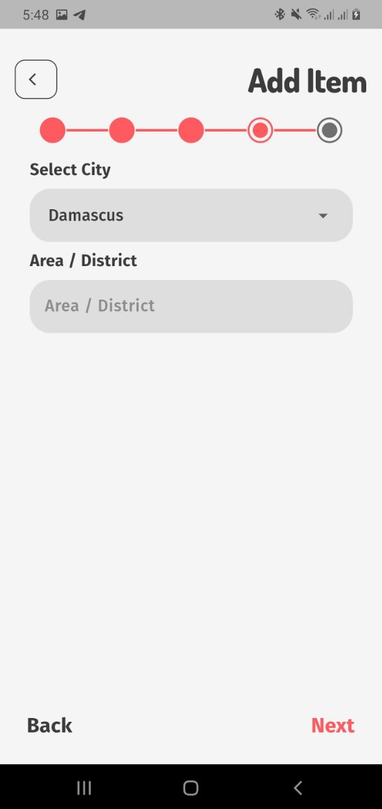
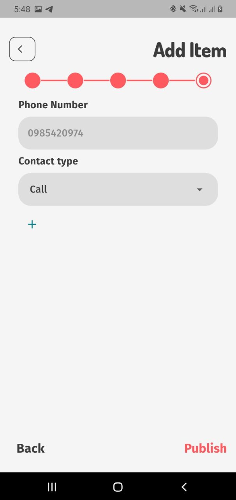

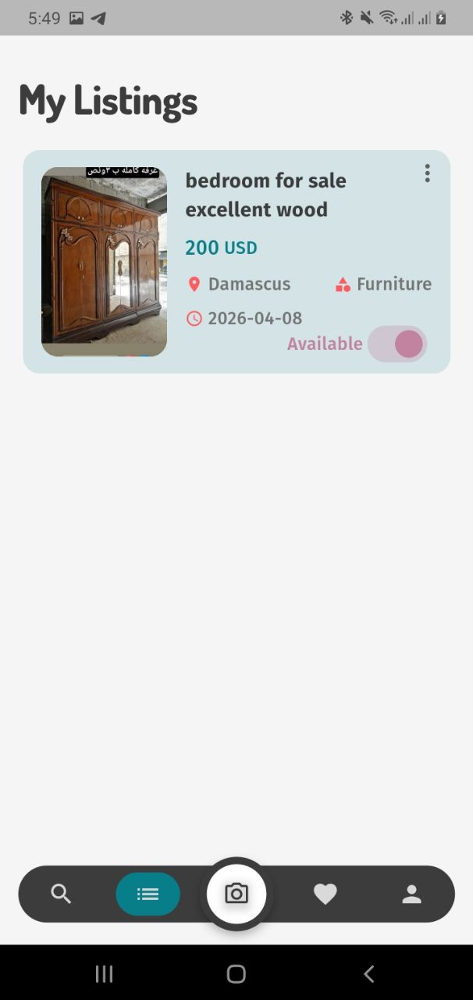
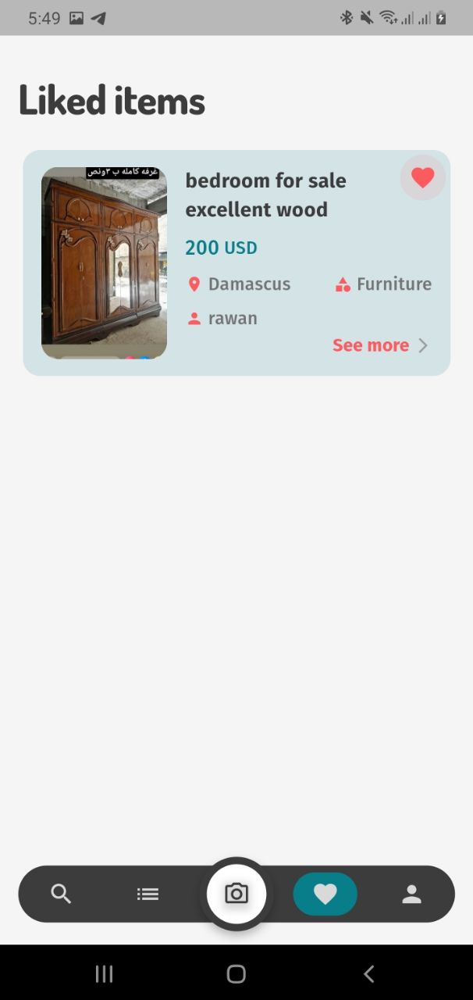
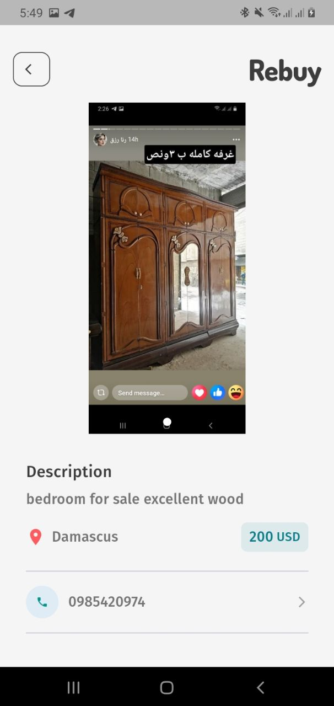
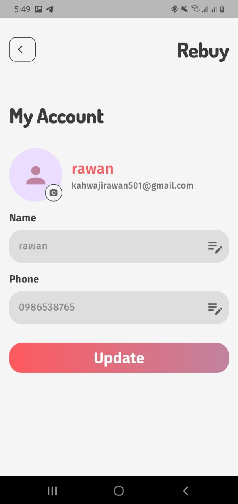
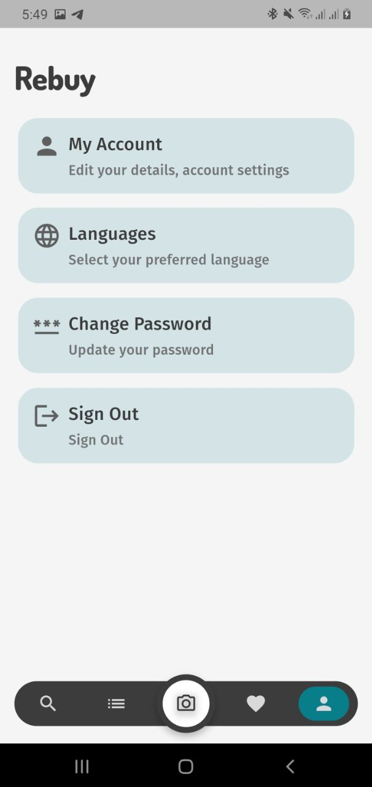
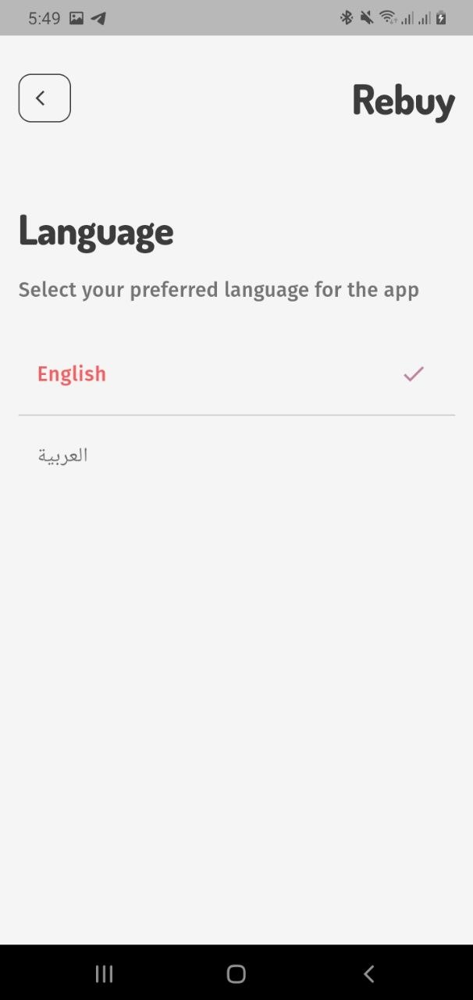
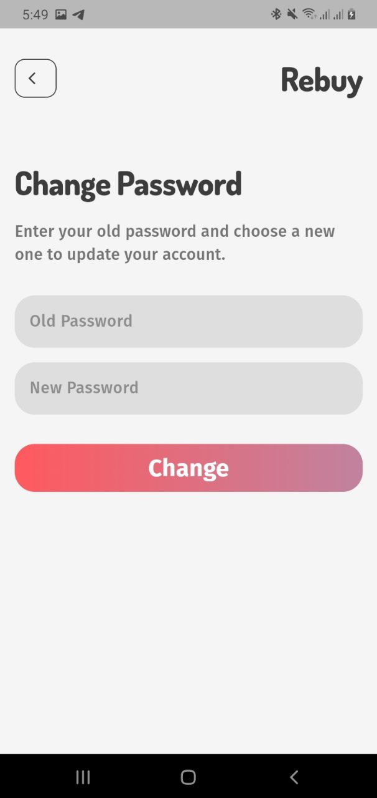

